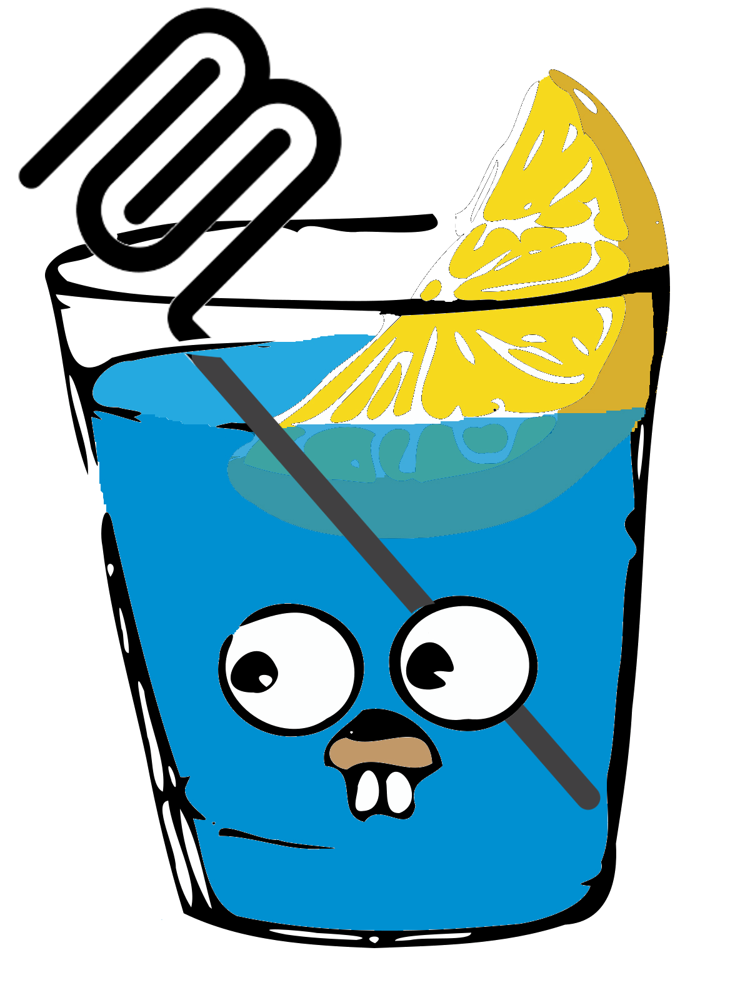

# Gin-MCP: Zero-Config Gin to MCP Bridge

[](https://pkg.go.dev/github.com/ckanthony/gin-mcp)
[](https://github.com/ckanthony/gin-mcp/actions/workflows/ci.yml)
[](https://codecov.io/gh/ckanthony/gin-mcp)


<div style="display: flex; align-items: start;">
<div style="flex: 1;">

**Enable MCP features for any Gin API with a line of code.**

Gin-MCP is an **opinionated, zero-configuration** library that automatically exposes your existing Gin endpoints as [Model Context Protocol (MCP)](https://modelcontextprotocol.io/introduction) tools, making them instantly usable by MCP-compatible clients like [Cursor](https://cursor.sh/).

Our philosophy is simple: **minimal setup, maximum productivity**. Just plug Gin-MCP into your Gin application, and it handles the rest.

</div>
<div style="flex: 0 0 auto; margin-left: 20px;">

</div>
</div>

## Why Gin-MCP?

-   **Effortless Integration:** Connect your Gin API to MCP clients without writing tedious boilerplate code.
-   **Zero Configuration (by default):** Get started instantly. Gin-MCP automatically discovers routes and infers schemas.
-   **Developer Productivity:** Spend less time configuring tools and more time building features.
-   **Flexibility:** While zero-config is the default, customize schemas and endpoint exposure when needed.
-   **Existing API:** Works with your existing Gin API - no need to change any code.

## Features

-   **Automatic Discovery:** Intelligently finds all registered Gin routes.
-   **Schema Inference:** Automatically generates MCP tool schemas from route parameters and request/response types (where possible).
-   **Direct Gin Integration:** Mounts the MCP server directly onto your existing `gin.Engine`.
-   **Parameter Preservation:** Accurately reflects your Gin route parameters (path, query) in the generated MCP tools.
-   **Customizable Schemas:** Manually register schemas for specific routes using `RegisterSchema` for fine-grained control.
-   **Selective Exposure:** Filter which endpoints are exposed using operation IDs or tags.
-   **Flexible Deployment:** Mount the MCP server within the same Gin app or deploy it separately.

## Installation

```bash
go get github.com/ckanthony/gin-mcp
```

## Basic Usage: Instant MCP Server

Get your MCP server running in minutes with minimal code:

```go
package main

import (
	"net/http"

	server "github.com/ckanthony/gin-mcp/"
	"github.com/gin-gonic/gin"
)

func main() {
	// 1. Create your Gin engine
	r := gin.Default()

	// 2. Define your API routes (Gin-MCP will discover these)
	r.GET("/ping", func(c *gin.Context) {
		c.JSON(http.StatusOK, gin.H{"message": "pong"})
	})

	r.GET("/users/:id", func(c *gin.Context) {
		// Example handler...
		userID := c.Param("id")
		c.JSON(http.StatusOK, gin.H{"user_id": userID, "status": "fetched"})
	})

	// 3. Create and configure the MCP server
	//    Provide essential details for the MCP client.
	mcp := server.New(r, &server.Config{
		Name:        "My Simple API",
		Description: "An example API automatically exposed via MCP.",
		// BaseURL is crucial! It tells MCP clients where to send requests.
		BaseURL: "http://localhost:8080",
	})

	// 4. Mount the MCP server endpoint
	mcp.Mount("/mcp") // MCP clients will connect here

	// 5. Run your Gin server
	r.Run(":8080") // Gin server runs as usual
}

```

That's it! Your MCP tools are now available at `http://localhost:8080/mcp`. Gin-MCP automatically created tools for `/ping` and `/users/:id`.

> **Note on `BaseURL`**: Always provide an explicit `BaseURL`. This tells the MCP server the correct address to forward API requests to when a tool is executed by the client. Without it, automatic detection might fail, especially in environments with proxies or different internal/external URLs.

## Advanced Usage

While Gin-MCP strives for zero configuration, you can customize its behavior.

### Fine-Grained Schema Control with `RegisterSchema`

Sometimes, automatic schema inference isn't enough. `RegisterSchema` allows you to explicitly define schemas for query parameters or request bodies for specific routes. This is useful when:

-   You use complex structs for query parameters (`ShouldBindQuery`).
-   You want to define distinct schemas for request bodies (e.g., for POST/PUT).
-   Automatic inference doesn't capture specific constraints (enums, descriptions, etc.) that you want exposed in the MCP tool definition.

```go
package main

import (
	// ... other imports
	"github.com/ckanthony/gin-mcp/pkg/server"
	"github.com/gin-gonic/gin"
)

// Example struct for query parameters
type ListProductsParams struct {
	Page  int    `form:"page,default=1" json:"page,omitempty" jsonschema:"description=Page number,minimum=1"`
	Limit int    `form:"limit,default=10" json:"limit,omitempty" jsonschema:"description=Items per page,maximum=100"`
	Tag   string `form:"tag" json:"tag,omitempty" jsonschema:"description=Filter by tag"`
}

// Example struct for POST request body
type CreateProductRequest struct {
	Name  string  `json:"name" jsonschema:"required,description=Product name"`
	Price float64 `json:"price" jsonschema:"required,minimum=0,description=Product price"`
}

func main() {
	r := gin.Default()

	// --- Define Routes ---
	r.GET("/products", func(c *gin.Context) { /* ... handler ... */ })
	r.POST("/products", func(c *gin.Context) { /* ... handler ... */ })
	r.PUT("/products/:id", func(c *gin.Context) { /* ... handler ... */ })


	// --- Configure MCP Server ---
	mcp := server.New(r, &server.Config{
		Name:        "Product API",
		Description: "API for managing products.",
		BaseURL:     "http://localhost:8080",
	})

	// --- Register Schemas ---
	// Register ListProductsParams as the query schema for GET /products
	mcp.RegisterSchema("GET", "/products", ListProductsParams{}, nil)

	// Register CreateProductRequest as the request body schema for POST /products
	mcp.RegisterSchema("POST", "/products", nil, CreateProductRequest{})

	// You can register schemas for other methods/routes as needed
	// e.g., mcp.RegisterSchema("PUT", "/products/:id", nil, UpdateProductRequest{})

	mcp.Mount("/mcp")
	r.Run(":8080")
}
```

**Explanation:**

-   `mcp.RegisterSchema(method, path, querySchema, bodySchema)`
-   `method`: HTTP method (e.g., "GET", "POST").
-   `path`: Gin route path (e.g., "/products", "/products/:id").
-   `querySchema`: An instance of the struct used for query parameters (or `nil` if none). Gin-MCP uses reflection and `jsonschema` tags to generate the schema.
-   `bodySchema`: An instance of the struct used for the request body (or `nil` if none).

### Filtering Exposed Endpoints

Control which Gin endpoints become MCP tools using operation IDs or tags (if your routes define them).

```go
// Only include specific operations by their Operation ID (if defined in your routes)
mcp := server.New(r, &server.Config{
    // ... other config ...
    IncludeOperations: []string{"getUser", "listUsers"},
})

// Exclude specific operations
mcp := server.New(r, &server.Config{
    // ... other config ...
    ExcludeOperations: []string{"deleteUser"}, // Don't expose deleteUser tool
})

// Only include operations tagged with "public" or "users"
mcp := server.New(r, &server.Config{
    // ... other config ...
    IncludeTags: []string{"public", "users"},
})

// Exclude operations tagged with "admin" or "internal"
mcp := server.New(r, &server.Config{
    // ... other config ...
    ExcludeTags: []string{"admin", "internal"},
})
```

**Filtering Rules:**

-   You can only use *one* inclusion filter (`IncludeOperations` OR `IncludeTags`).
-   You can only use *one* exclusion filter (`ExcludeOperations` OR `ExcludeTags`).
-   You *can* combine an inclusion filter with an exclusion filter (e.g., include tag "public" but exclude operation "legacyPublicOp"). Exclusion takes precedence.

### Customizing Schema Descriptions (Less Common)

For advanced control over how response schemas are described in the generated tools (often not needed):

```go
mcp := server.New(r, &server.Config{
    // ... other config ...
    DescribeAllResponses:    true, // Include *all* possible response schemas (e.g., 200, 404) in tool descriptions
    DescribeFullResponseSchema: true, // Include the full JSON schema object instead of just a reference
})
```

## Examples

See the [`examples`](examples) directory for complete, runnable examples demonstrating various features.

## Connecting an MCP Client (e.g., Cursor)

Once your Gin application with Gin-MCP is running:

1.  Start your application.
2.  In your MCP client (like Cursor Settings -> MCP), provide the URL where you mounted the MCP server (e.g., `http://localhost:8080/mcp`) as the SSE endpoint.
3.  The client will connect and automatically discover the available API tools.

## Contributing

Contributions are welcome! Please feel free to submit issues or Pull Requests. 